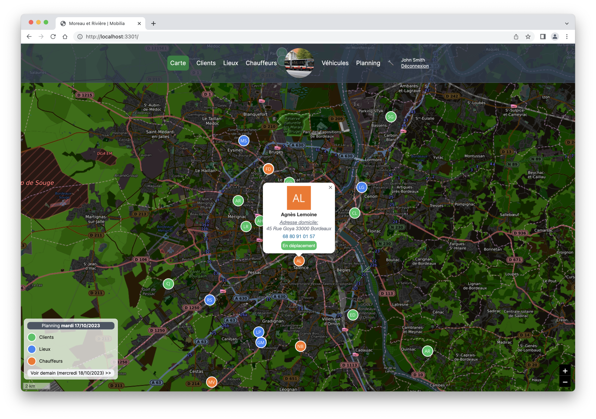
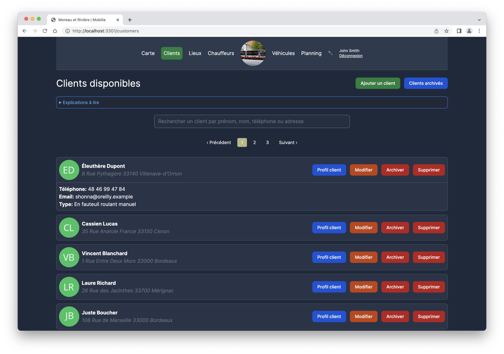
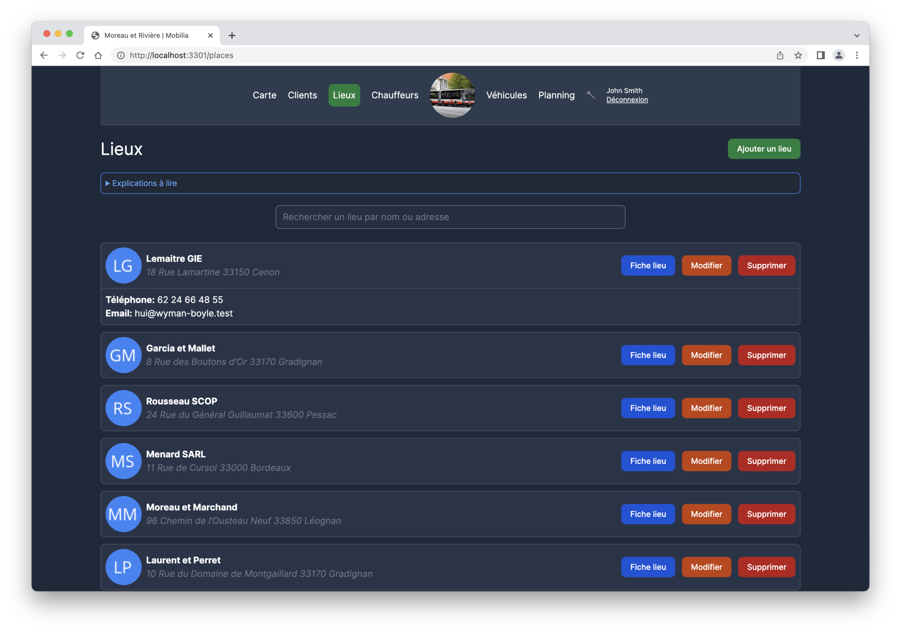
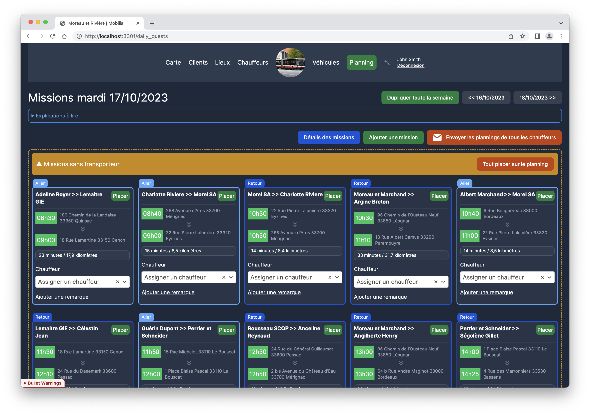
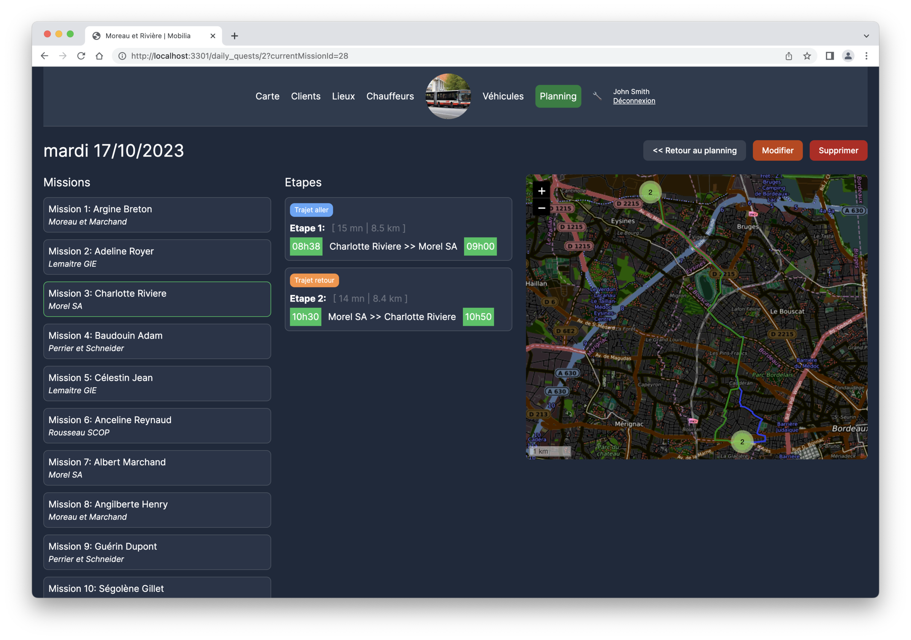
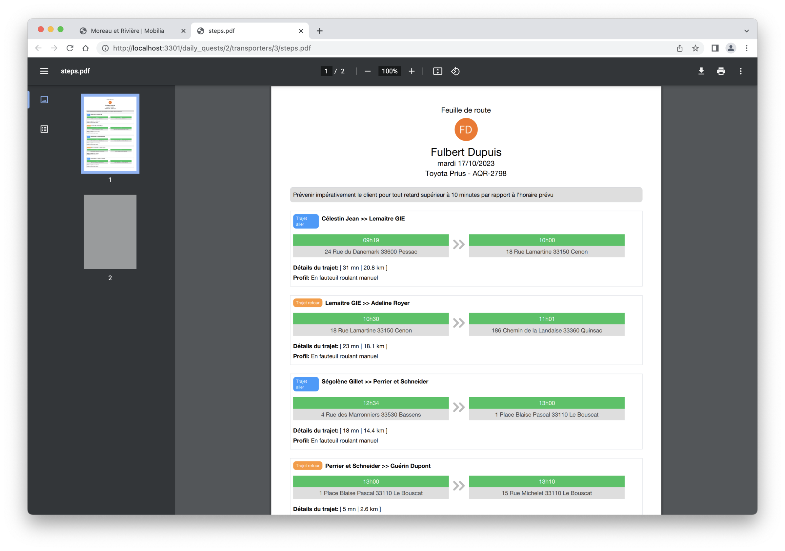

# Mobilia

mobilia is the NeXT generation transportation planning.  
It handles the management and routing of your fleet and drivers



## Features

- Global view of daily map ( transporters, customers and destination places)
- Live map refresh of transporters location (theoric estimation from missions)
- Management of customers
- Management of destination places
- Management of drivers
- Management of vehicles
- Management of missions
- Management of daily plannings, including:
  - Automatic distribution of journeys
  - Auto compute of time travelling ( needed for auto-planning)
  - Duplication of a week to the next one
  - Generation of PDF routes for each transporter
  - Sending of PDF by email (to one driver or to all of them)
- Basic settings to personalize experience

## Tools

Mobilia is built with the following technologies:

- [Ruby on Rails 7.1](https://rubyonrails.org)
- [PostgreSQL](https://www.postgresql.org)
- [Tailwind CSS](https://tailwindcss.com)
- [Docker](https://www.docker.com) (facultative)
- [OSRM](http://project-osrm.org) as matching routing API

## Setup project

To setup the development project, follow these instructions:

- Clone the project
- Go to project folder: `$ cd mobilia`
- Run `$ docker-compose up -d` to start PostgreSQL container (facultative)
- Run `$ bundle install`
- Run `$ bin/rails db:encryption:init` to generate encryption keys and paste these values to corresponding ENV vars:

  ```bash
  # .env
  ACTIVE_RECORD_ENCRYPTION_PRIMARY_KEY=my_primary_key
  ACTIVE_RECORD_ENCRYPTION_DETERMINISTIC_KEY=my_deterministic_key
  ACTIVE_RECORD_ENCRYPTION_KEY_DERIVATION_SALT=my_key_derivation_salt
  ```

- Run `$ bin/rails db:migrate db:seed`
- Finally launch the Rails server with `$ bin/dev` !

## Screenshots

### Customers


### Places


### Planning


### Missions details


### Generated PDF


## Contributing

We encourage you to contribute to mobilia ! Project is still very early in its development and bugs are likely to emerge ;)

## Sponsoring

If you appreciate this project and would like to support developpers team, you can send some satochis to **bc1qkaq059gxysmrvsuv2ut7cnjnvec557dep5zjgk** address:

  

Thank you ! 🥳🍻

## License

mobilia is released under the MIT License.
