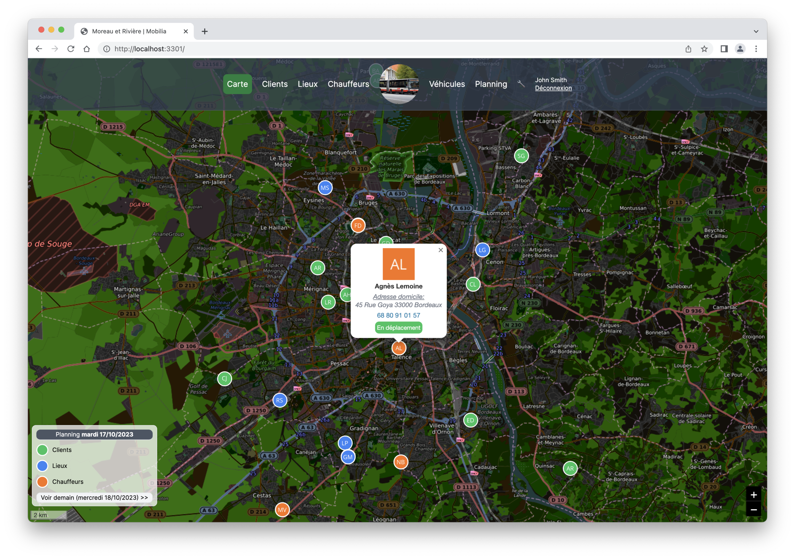
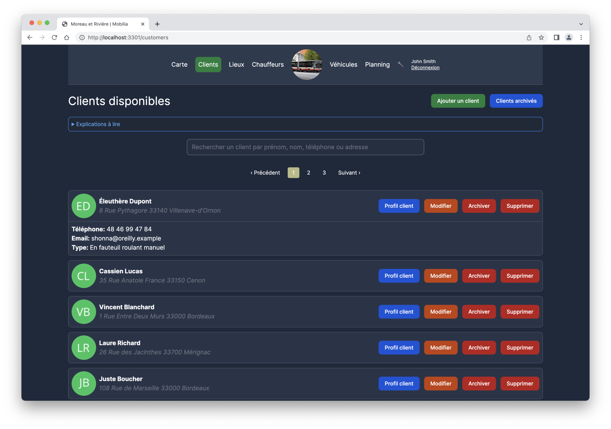
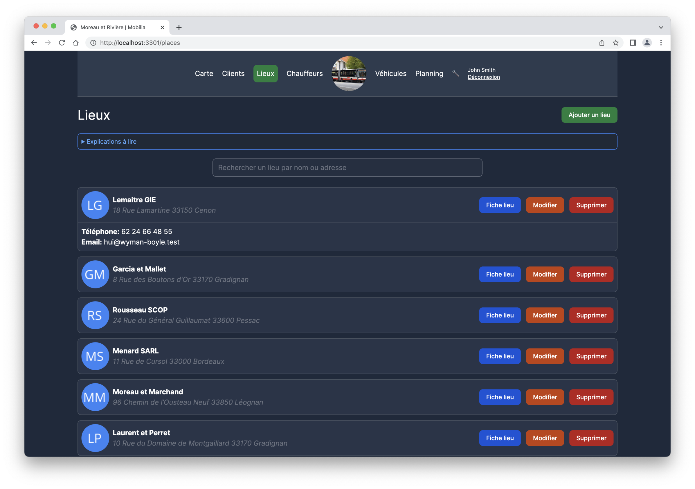
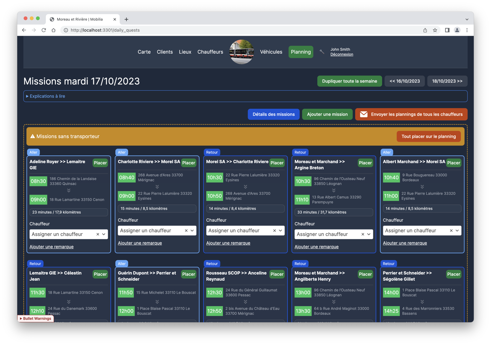
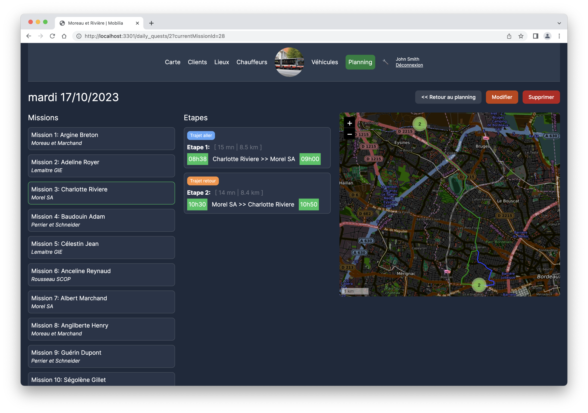
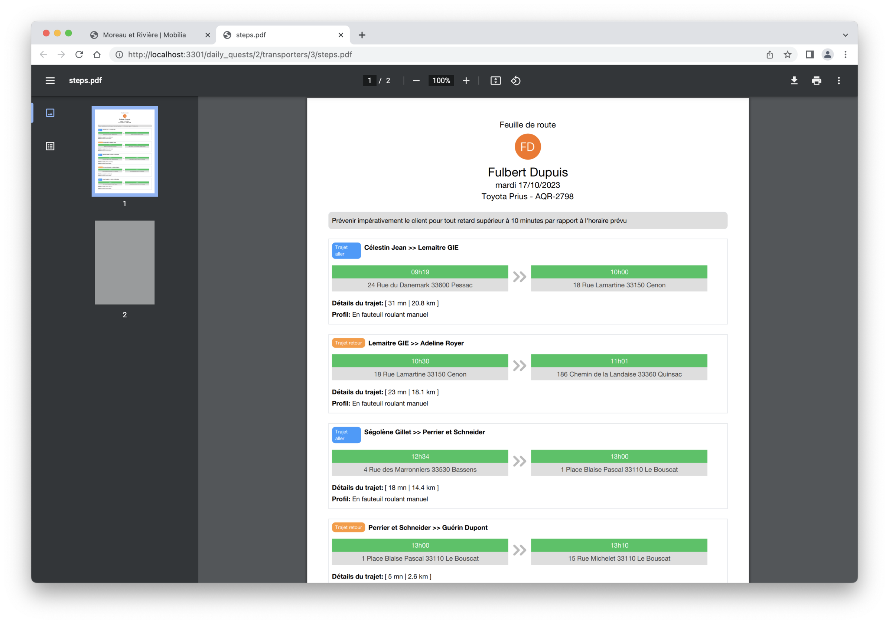

# Mobilia

mobilia is the NeXT generation transportation planning.  
It handles the management and routing of your fleet and drivers



## Features

- Global view of daily map ( transporters, customers and destination places)
- Live map refresh of transporters location (theoric estimation from missions)
- Management of customers
- Management of destination places
- Management of drivers
- Management of vehicles
- Management of missions
- Management of daily plannings, including:
  - Automatic distribution of journeys
  - Auto compute of time travelling ( needed for auto-planning)
  - Duplication of a week to the next one (coming soon)
  - Generation of PDF routes for each transporter
  - Sending of PDF by email (to one driver or to all of them)
- Basic settings to personalize experience

## Tools

Mobilia is built with the following technologies:

- [Ruby 4.0](https://www.ruby-lang.org)
- [Ruby on Rails 8.1](https://rubyonrails.org)
- [PostgreSQL](https://www.postgresql.org)
- [Tailwind CSS](https://tailwindcss.com)
- [Docker](https://www.docker.com) (facultative)
- [OSRM](http://project-osrm.org) as matching routing API

## Setup project

- Check that Ruby 4.0.4 is installed (`$ ruby -v`)
- Go to the project folder: `$ cd mobilia`
- Make sure PostgreSQL and Redis are running (see below)
- Run `$ bin/setup` — it installs the gems, writes a `.env` with freshly
  generated secrets, prepares the database and restarts the application
- Launch the development servers with `$ bin/dev`

`bin/setup` only writes `.env` when it is missing, so it is safe to re-run.

### Database and Redis

`config/database.yml` defaults to PostgreSQL on `127.0.0.1:5432` with the
`mobilia` role and password — what `docker compose up -d` creates. The role and
both databases have to exist before `db:prepare`:

```sql
CREATE ROLE mobilia WITH LOGIN SUPERUSER PASSWORD 'mobilia';
CREATE DATABASE mobilia_development OWNER mobilia;
CREATE DATABASE mobilia_test OWNER mobilia;
```

If your PostgreSQL listens on another port, say so in `.env`:

```bash
POSTGRES_PORT=5435        # development
POSTGRES_TEST_PORT=5435   # test
```

Redis defaults to `redis://127.0.0.1:6379/1` and can be overridden with
`REDIS_URL`.

### Doing it by hand

```bash
$ bundle install
$ cp .env.template .env
$ bin/rails db:encryption:init   # copy the three keys into .env
$ bin/rails db:prepare
$ bin/dev
```

The application will not boot without the three
`ACTIVE_RECORD_ENCRYPTION_*` values: they encrypt users' names, phones and
emails. `bin/rails db:encryption:init` prints fresh ones and works even when
`.env` is empty or missing, because the check lives in an initializer rather
than in `config/application.rb`.

## Tests

The suite runs against the `mobilia_test` database described by the committed
`.env.test` (throwaway keys, no secrets needed) and never touches the network:
geocoding, the avatar service and OSRM are all stubbed.

```bash
$ RAILS_ENV=test bin/rails db:create db:schema:load
$ bundle exec rspec
```

Use `db:create db:schema:load` rather than `db:prepare`: on a freshly created
database `db:prepare` also runs `db/seeds.rb`, which calls the geocoding, avatar
and routing services.

## Demonstration

Visit [https://mobilia.flownaely.cafe](https://mobilia.flownaely.cafe) for an online demonstration.

Use following credentials to log in as an administrator:
- Email: **admin@demo.test**
- Password: **password**

Note that the database is seed once a day so all data will be dropped and regenerated.

## Screenshots

### Customers


### Places


### Planning


### Missions details


### Generated PDF


## Contributing

We encourage you to contribute to mobilia by opening issues and/or pull requests !  
Project is still very early in its development and bugs are likely to emerge ;)

## Sponsoring

If you appreciate this project and would like to support developpers team, you can send some satochis to **bc1qkaq059gxysmrvsuv2ut7cnjnvec557dep5zjgk** address:

  

Thank you ! 🥳🍻

## License

mobilia is released under the MIT License.
